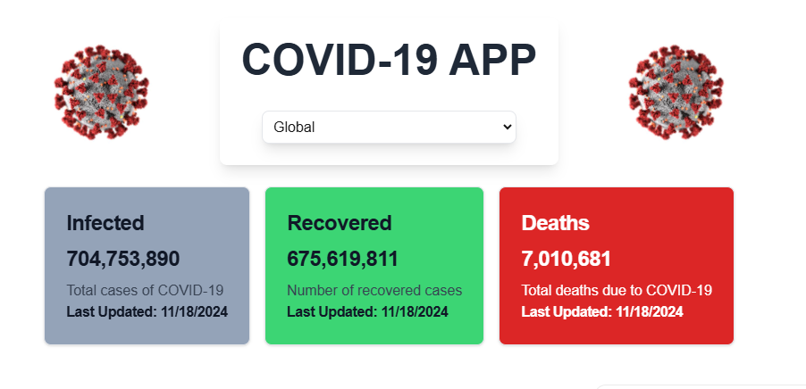
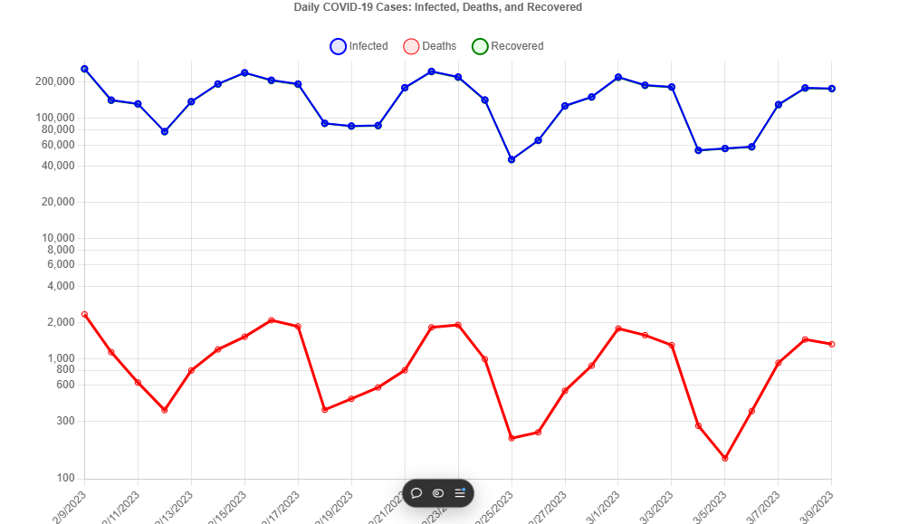
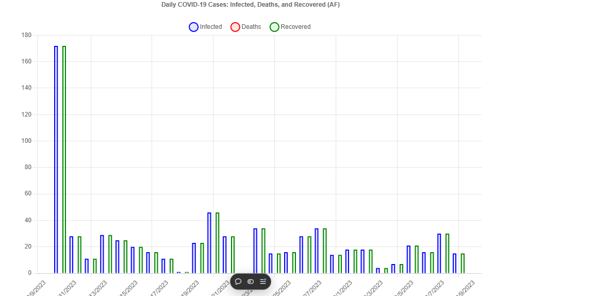

Here’s an updated and more polished version of your README.md file to make it even more engaging and professional:

---

# COVID-19 Tracker App

The *COVID-19 Tracker App* is a powerful web application that provides real-time insights into the global and country-specific impact of the COVID-19 pandemic. Featuring interactive visualizations, historical data, and responsive design, this app is your go-to tool for understanding pandemic trends in a clear and concise manner.

---

## Features at a Glance

- 🌎 *Global and Country-specific Statistics*  
  - Stay informed with worldwide and localized COVID-19 data, including cases, recoveries, and deaths.

- 🔄 *Real-time Data Updates*  
  - Leveraging live APIs for the latest statistics, ensuring the information is always accurate.

- 📊 *Interactive Charts*  
  - Line charts for global trends and bar charts for country-specific insights.  
  - Hover over data points to reveal daily statistics.

- 🔍 *Search and Filter Options*  
  - Quickly switch between countries using a dropdown menu with real-time search capabilities.

- 📅 *Historical Data Analysis*  
  - Explore how COVID-19 trends have evolved over time.

- 📱 *Responsive Design*  
  - Fully optimized for use on all devices, from mobile phones to large screens.

---

## Live APIs Used

### Global and Country-specific Data
- *Endpoint*: [https://disease.sh/v3/covid-19/all](https://disease.sh/v3/covid-19/all)  
- *Description*: Fetch global COVID-19 statistics including total cases, recoveries, deaths, and daily updates.  

#### Country-specific Data:  
- Use [https://disease.sh/v3/covid-19/countries/{country}](https://disease.sh/docs/#/COVID-19%3A%20Countries/get_v3_covid_19_countries_country) by replacing {country} with an ISO2 code (e.g., US, IN, etc.).

### Historical Data
- *Endpoint*: [https://disease.sh/v3/covid-19/historical/all](https://disease.sh/v3/covid-19/historical/all)  
- *Description*: Access historical global data for cases, recoveries, and deaths to track daily differences.

---

## Installation & Setup

Follow these steps to set up the application locally:

### Step 1: Clone the Repository
bash
git clone https://github.com/your-repo/covid-19-tracker.git
cd covid-19-tracker

### Step 2: Install Dependencies
bash
npm install

### Step 3: Start the Development Server
bash
npm run dev

The app will be accessible at [http://localhost:3000](http://localhost:3000).

---

## How to Use

1. *View Global Statistics*  
   - By default, the app displays worldwide statistics and trends using an interactive line chart.

2. *Country-specific Insights*  
   - Select a country from the dropdown menu to view detailed statistics and trends in a bar chart.

3. *Hover for Details*  
   - Hover over data points on the charts to see exact figures for each day.

4. *Explore Historical Data*  
   - Dive into the historical timeline to analyze how cases, recoveries, and deaths have evolved over time.

---

## Built With

- *Frontend*: React, Next.js, TypeScript  
- *Styling*: Tailwind CSS  
- *Charts*: Chart.js  
- *Data Fetching*: Axios  
- *APIs*: [Disease.sh COVID-19 API](https://disease.sh/docs/)

---

P
## Screenshots

### 1. Home Page  

### 2. Global Statistics Chart  

### 3. Country Dropdown and Bar Chart  

- Global statistics chart  
- Country dropdown selection  
- Bar chart with country-specific insights  

---

## Deployment

### Deploy on Vercel  
The easiest way to deploy your Next.js app is through [Vercel](https://vercel.com).  

### Steps:  
1. Sign in to [Vercel](https://vercel.com).  
2. Link your GitHub repository.  
3. Follow the guided deployment process.  

For more details, see the official [Next.js Deployment Documentation](https://nextjs.org/docs/app/building-your-application/deploying).

---

## Learn More about Next.js

- *[Next.js Documentation](https://nextjs.org/docs)*: Explore Next.js features and API references.  
- *[Interactive Tutorials](https://nextjs.org/learn)*: Hands-on learning with step-by-step examples.  
- *[GitHub Repository](https://github.com/vercel/next.js)*: Contribute to the Next.js community.

---

## License

This project is licensed under the *MIT License*. Feel free to use, modify, and distribute it as per the terms of the license.

---

## Contributing

Contributions are welcome!  
1. Fork the repository.  
2. Create a new branch for your feature (git checkout -b feature-name).  
3. Commit your changes (git commit -m 'Add feature').  
4. Push to the branch (git push origin feature-name).  
5. Open a pull request.

---

This polished README.md is now more engaging, with clear sections and formatting, and provides all the necessary information to attract contributors and guide users.
